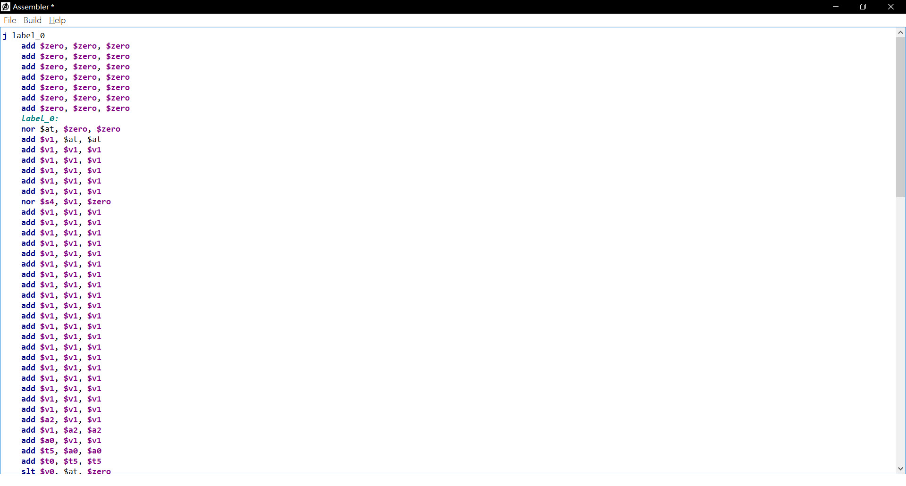
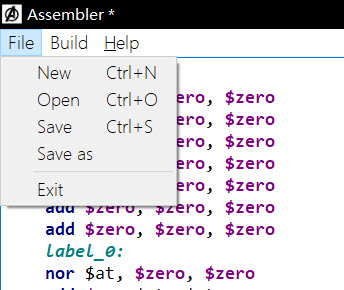
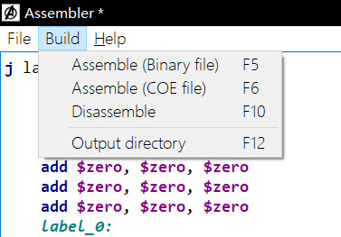
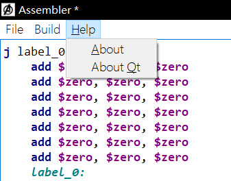

#  Assembler

## The project is written by Cpp, QT5.8. It's for Computer Organization, ZJU.

> Have basic features of text editor.

> Support syntex highlighting.

> Translate mips assemble code into COE or BIN files

> Disassemble BIN or COE files back to assemble codes

## Interface

## MENU

## EXAMPLE

### Basic_single_cycle.asm
    j label_0
    add $zero, $zero, $zero
    add $zero, $zero, $zero
    add $zero, $zero, $zero
    add $zero, $zero, $zero
    add $zero, $zero, $zero
    add $zero, $zero, $zero
    add $zero, $zero, $zero
    label_0:
    nor $at, $zero, $zero
    add $v1, $at, $at
    add $v1, $v1, $v1
    add $v1, $v1, $v1
    add $v1, $v1, $v1
    add $v1, $v1, $v1
    add $v1, $v1, $v1
    nor $s4, $v1, $zero
    add $v1, $v1, $v1
    add $v1, $v1, $v1
    add $v1, $v1, $v1
    add $v1, $v1, $v1
    add $v1, $v1, $v1
    add $v1, $v1, $v1
    add $v1, $v1, $v1
    add $v1, $v1, $v1
    add $v1, $v1, $v1
    add $v1, $v1, $v1
    add $v1, $v1, $v1
    add $v1, $v1, $v1
    add $v1, $v1, $v1
    add $v1, $v1, $v1
    add $v1, $v1, $v1
    add $v1, $v1, $v1
    add $v1, $v1, $v1
    add $v1, $v1, $v1
    add $v1, $v1, $v1
    add $v1, $v1, $v1
    add $a2, $v1, $v1
    add $v1, $a2, $a2
    add $a0, $v1, $v1
    add $t5, $a0, $a0
    add $t0, $t5, $t5
    slt $v0, $at, $zero
    add $t6, $v0, $v0
    add $t6, $t6, $t6
    nor $t2, $zero, $zero
    add $t2, $t2, $t2
    sw $a2, 4($v1)
    lw $a1, ($v1)
    add $a1, $a1, $a1
    add $a1, $a1, $a1
    sw $a1, ($v1)
    add $t1, $t1, $v0
    sw $t1, ($a0)
    lw $t5, 20($zero)
    label_5:
    lw $a1, ($v1)
    add $a1, $a1, $a1
    add $a1, $a1, $a1
    sw $a1, ($v1)
    lw $a1, ($v1)
    and $t3, $a1, $t0
    add $t5, $t5, $v0
    beq $t5, $zero, label_1
    label_10:
    lw $a1, ($v1)
    add $s2, $t6, $t6
    add $s6, $s2, $s2
    add $s2, $s2, $s6
    and $t3, $a1, $s2
    beq $t3, $zero, label_2
    beq $t3, $s2, label_3
    add $s2, $t6, $t6
    beq $t3, $s2, label_4
    sw $t1, ($a0)
    j label_5
    label_2:
    beq $t2, $at, label_6
    j label_7
    label_6:
    nor $t2, $zero, $zero
    add $t2, $t2, $t2
    label_7:
    sw $t2, ($a0)
    j label_5
    label_3:
    lw $t1, 96($s1)
    sw $t1, ($a0)
    j label_5
    label_4:
    lw $t1, 32($s1)
    sw $t1, ($a0)
    j label_5
    label_1:
    lw $t5, 20($zero)
    add $t2, $t2, $t2
    or $t2, $t2, $v0
    add $s1, $s1, $t6
    and $s1, $s1, $s4
    add $t1, $t1, $v0
    beq $t1, $at, label_8
    j label_9
    label_8:
    add $t1, $zero, $t6
    add $t1, $t1, $v0
    label_9:
    lw $a1, ($v1)
    add $t3, $a1, $a1
    add $t3, $t3, $t3
    sw $t3, ($v1)
    sw $a2, 4($v1)
    lw $a1, ($v1)
    and $t3, $a1, $t0
    j label_10

### Basic_single_cycle.coe
    memory_initialization_radix=16;
    memory_initialization_vector=
    08000008, 00000020, 00000020, 00000020, 00000020, 00000020, 00000020, 00000020,
    00000827, 00211820, 00631820, 00631820, 00631820, 00631820, 00631820, 0060A027,
    00631820, 00631820, 00631820, 00631820, 00631820, 00631820, 00631820, 00631820,
    00631820, 00631820, 00631820, 00631820, 00631820, 00631820, 00631820, 00631820,
    00631820, 00631820, 00631820, 00631820, 00633020, 00C61820, 00632020, 00846820,
    01AD4020, 0020102A, 00427020, 01CE7020, 00005027, 014A5020, AC660004, 8C650000,
    00A52820, 00A52820, AC650000, 01224820, AC890000, 8C0D0014, 8C650000, 00A52820,
    00A52820, AC650000, 8C650000, 00A85824, 01A26820, 11A00017, 8C650000, 01CE9020,
    0252B020, 02569020, 00B25824, 11600005, 1172000A, 01CE9020, 1172000B, AC890000,
    08000036, 11410001, 0800004D, 00005027, 014A5020, AC8A0000, 08000036, 8E290060,
    AC890000, 08000036, 8E290020, AC890000, 08000036, 8C0D0014, 014A5020, 01425025,
    022E8820, 02348824, 01224820, 11210001, 0800005F, 000E4820, 01224820, 8C650000,
    00A55820, 016B5820, AC6B0000, AC660004, 8C650000, 00A85824, 0800003E;

### Disassemble the coe file above
    j label0;
    add $zero,$zero,$zero;
    add $zero,$zero,$zero;
    add $zero,$zero,$zero;
    add $zero,$zero,$zero;
    add $zero,$zero,$zero;
    add $zero,$zero,$zero;
    add $zero,$zero,$zero;
    label0:
    nor $at,$zero,$zero;
    add $v1,$at,$at;
    add $v1,$v1,$v1;
    add $v1,$v1,$v1;
    add $v1,$v1,$v1;
    add $v1,$v1,$v1;
    add $v1,$v1,$v1;
    nor $s4,$v1,$zero;
    add $v1,$v1,$v1;
    add $v1,$v1,$v1;
    add $v1,$v1,$v1;
    add $v1,$v1,$v1;
    add $v1,$v1,$v1;
    add $v1,$v1,$v1;
    add $v1,$v1,$v1;
    add $v1,$v1,$v1;
    add $v1,$v1,$v1;
    add $v1,$v1,$v1;
    add $v1,$v1,$v1;
    add $v1,$v1,$v1;
    add $v1,$v1,$v1;
    add $v1,$v1,$v1;
    add $v1,$v1,$v1;
    add $v1,$v1,$v1;
    add $v1,$v1,$v1;
    add $v1,$v1,$v1;
    add $v1,$v1,$v1;
    add $v1,$v1,$v1;
    add $a2,$v1,$v1;
    add $v1,$a2,$a2;
    add $a0,$v1,$v1;
    add $t5,$a0,$a0;
    add $t0,$t5,$t5;
    slt $v0,$at,$zero;
    add $t6,$v0,$v0;
    add $t6,$t6,$t6;
    nor $t2,$zero,$zero;
    add $t2,$t2,$t2;
    sw $a2,4($v1);
    lw $a1,0($v1);
    add $a1,$a1,$a1;
    add $a1,$a1,$a1;
    sw $a1,0($v1);
    add $t1,$t1,$v0;
    sw $t1,0($a0);
    lw $t5,20($zero);
    label5:
    lw $a1,0($v1);
    add $a1,$a1,$a1;
    add $a1,$a1,$a1;
    sw $a1,0($v1);
    lw $a1,0($v1);
    and $t3,$a1,$t0;
    add $t5,$t5,$v0;
    beq $t5,$zero,label1;
    label10:
    lw $a1,0($v1);
    add $s2,$t6,$t6;
    add $s6,$s2,$s2;
    add $s2,$s2,$s6;
    and $t3,$a1,$s2;
    beq $t3,$zero,label2;
    beq $t3,$s2,label3;
    add $s2,$t6,$t6;
    beq $t3,$s2,label4;
    sw $t1,0($a0);
    j label5;
    label2:
    beq $t2,$at,label6;
    j label7;
    label6:
    nor $t2,$zero,$zero;
    add $t2,$t2,$t2;
    label7:
    sw $t2,0($a0);
    j label5;
    label3:
    lw $t1,96($s1);
    sw $t1,0($a0);
    j label5;
    label4:
    lw $t1,32($s1);
    sw $t1,0($a0);
    j label5;
    label1:
    lw $t5,20($zero);
    add $t2,$t2,$t2;
    or $t2,$t2,$v0;
    add $s1,$s1,$t6;
    and $s1,$s1,$s4;
    add $t1,$t1,$v0;
    beq $t1,$at,label8;
    j label9;
    label8:
    add $t1,$zero,$t6;
    add $t1,$t1,$v0;
    label9:
    lw $a1,0($v1);
    add $t3,$a1,$a1;
    add $t3,$t3,$t3;
    sw $t3,0($v1);
    sw $a2,4($v1);
    lw $a1,0($v1);
    and $t3,$a1,$t0;
    j label10;

## Support the following instructions.

## Rtype
* add
* addu
* sub
* subu
* and
* or
* xor
* nor
* sll
* srl
* sra
* slt
* sltu
* jr
* jar

## Itype
* addi
* addiu
* slti
* sltiu
* andi
* ori
* xori
* lui
* lw
* lb
* lbu
* lh
* lhu
* sw
* sh
* sb
* beq
* bne
* blez
* bgtz
* bltz
* bgez

## Jtype
* j
* jal